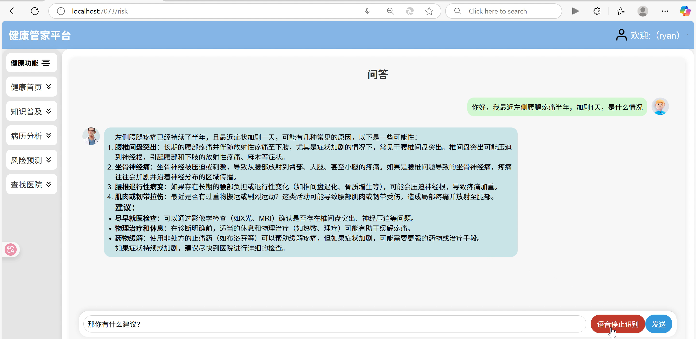

# medical

#### 介绍
 **健康管家平台** 

项目基本内容
 **健康 “管家” 平台**  —— 基于大数据依据病历（症状），辅助预测病症的平台开发项目（以下简称 “健康管家” 平台）是一个基于大数据服务用户，为用户提供医学方面服务与知识拓展的一定专业技术平台。

“健康管家” 平台以 “科技促进健康” 作为项目的发展目标。我们将对平台接入互联网并学习形成一个存在各种病症的数据库为用户普及知识，还可使得用户上传病历（症状），平台进行筛选；使用算法，使得从选出的病症中继续深入与用户完善数据能够使算法辅助给出预测，将患病风险形成评估报告给予用户。

平台的主要组成方向有：

1.	基础界面：借助机器算法、大数据来将患病风险形成评估报告给予用户，以及与医院（医生）加入为用户提供医学方面服务与知识拓展。
2.	老年服务：打造 “健康手环” 形成电子追踪器（监护器），形成二维码中存有用户电子病历，并且与家人、社区医院联网实时可视以应对突发情况。

#### 参与贡献

1.  Fork 本仓库
2.  新建 Feat_xxx 分支
3.  提交代码
4.  新建 Pull Request

#### 特技

1.  使用 Readme\_XXX.md 来支持不同的语言，例如 Readme\_en.md, Readme\_zh.md
2.  Gitee 官方博客 [blog.gitee.com](https://blog.gitee.com)
3.  你可以 [https://gitee.com/explore](https://gitee.com/explore) 这个地址来了解 Gitee 上的优秀开源项目
4.  [GVP](https://gitee.com/gvp) 全称是 Gitee 最有价值开源项目，是综合评定出的优秀开源项目
5.  Gitee 官方提供的使用手册 [https://gitee.com/help](https://gitee.com/help)
6.  Gitee 封面人物是一档用来展示 Gitee 会员风采的栏目 [https://gitee.com/gitee-stars/](https://gitee.com/gitee-stars/)
